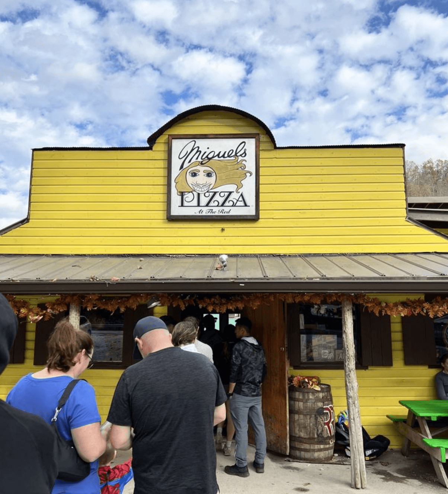
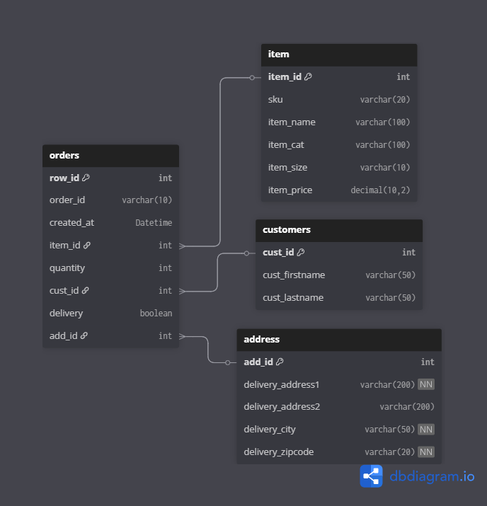

# Restaurant Sales SQL Project

## Overview
This project simulates transactional data for a pizza restaurant and uses SQL to analyze sales performance, customer behavior, and ordering patterns. The dataset was generated using Python (Faker) to mimic realistic restaurant operations, including customers, orders, and delivery activity over time. The project is inspired by Miguel’s Pizza, a real restaurant that my spouse and I love, which served as the conceptual foundation for the business scenario. While the structure and idea are grounded in that experience, the menu items and underlying data are synthetically generated and do not directly reflect the actual restaurant. This project demonstrates relational database design across multiple tables (orders, customers, address, item), data generation using Python, and SQL-based analysis of revenue, product performance, and customer trends, with the goal of showcasing practical SQL skills in a realistic business context.



## Dataset
The database contains four tables:
- orders
- customers
- address
- item

## Tools Used
- MySQL Workbench
- dbdiagram.io
- Python
- CSV files

## Schema



## Business Questions
- What are the best-selling items?
- Which items generate the most revenue?
- What are the busiest ordering times?
- Which customers spend the most?
- How many orders are delivery vs pickup?

## Key Metrics

- Total Revenue: $91,342
- Average Order Value: $18.27
- Top Item: Pepperoni Pizza
- Top Category: Pizza
- Total Orders: 5,000

## Query Results & Insights

### Revenue Overview
- Total revenue generated across all orders was approximately $91,342.
- The average order value indicates moderate per-transaction spend, consistent with single-item or small basket purchases in the dataset.

### Product Performance
- Core menu items, particularly pizza variations, dominated both sales volume and revenue.
- The highest-grossing item significantly outperformed other menu options, reinforcing the importance of staple offerings.
- Category-level analysis shows that primary food categories (e.g., pizza and subs) contribute the majority of total revenue, while sides, drinks, and desserts play a smaller supporting role.

### Customer Behavior
- A small subset of customers generated a disproportionately high share of total revenue, indicating repeat purchasing behavior and the presence of high-value customers.
- This pattern suggests potential opportunities for loyalty programs or targeted promotions.

### Order Timing Trends
- Order volume peaks during lunch (around 12 PM) and dinner hours (6–7 PM), with the highest concentration of orders occurring in the early evening.
- Orders drop off significantly after 8 PM, reflecting typical restaurant demand patterns.
- Day-of-week trends show variation in order volume, with certain days consistently outperforming others.

### Delivery vs Pickup
- Delivery and pickup orders are relatively balanced, indicating that both channels are important contributors to overall business performance.
- This suggests the restaurant operates in a hybrid model where both convenience (delivery) and in-person pickup are equally utilized.

### Geographic Trends
- Revenue is concentrated in specific zip codes, indicating localized clusters of demand.
- These high-performing areas could represent key markets for targeted marketing or expansion.

### Data Notes
- This dataset is synthetically generated, and each order record represents a single item-level transaction within the simplified schema.
- Despite this, the observed patterns align with realistic restaurant behavior due to weighted data generation.

## Structure
```
sql-restaurant-sales-project/
│
├── README.md
├── analysis_queries.sql
└── data/
    ├── customers.csv
    ├── address.csv
    ├── items.csv
    ├── orders.csv
    ├── generate_item.py
    └── generate_cust_order.py
└── images/
    ├── Miguels_Pizza.png
    └── ERD_dbdiagram.png
```
## Data Generation

The dataset was generated using Python and the Faker library to simulate realistic restaurant activity. The data includes randomized customer information, delivery addresses, menu items, and weighted order behavior to better reflect real-world patterns.

The script used to generate the data can be found in:
`data/generate_data.py`
`data/generate_items.py`

It creates:
- customers.csv
- address.csv
- orders.csv
- items.csv

## Files
